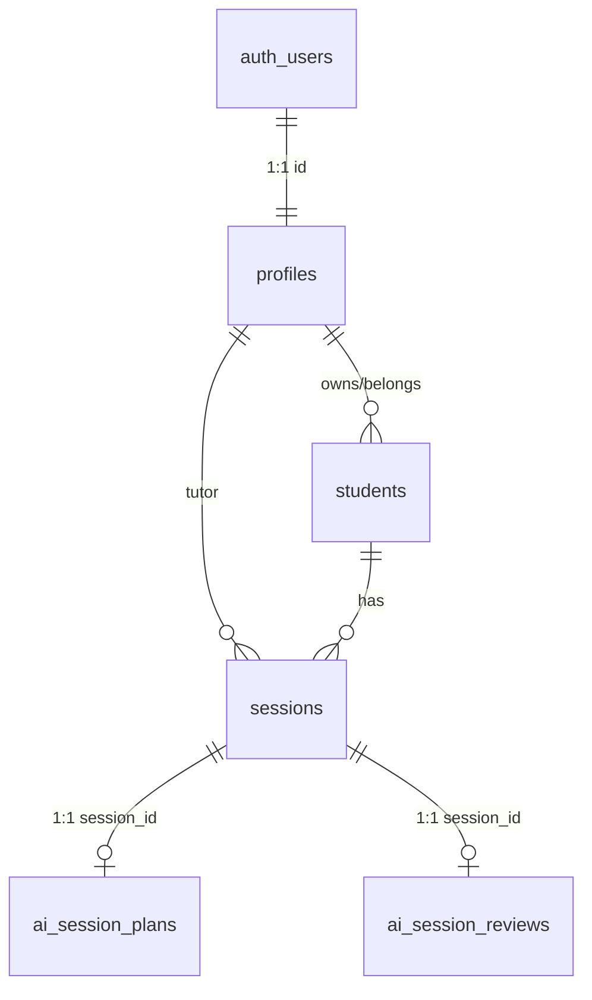

# TutorFlow - Tutor Management & AI-Assisted Tutoring Platform

TutorFlow is a clean, modern web application designed for online tutors to manage 1-on-1 tutoring sessions, track student progress, and utilize Google Gemini AI to generate personalized lesson plans, session reviews, homework assignments, and overall progress summaries.

---

## Live Demo & Repository
- **Live Working URL**: `[Your Vercel Deployment Link]`
- **GitHub Repository**: `[Your GitHub Repo Link]`

---

## Test Login Credentials

| Role | Email | Password |
| :--- | :--- | :--- |
| **Tutor** | `tutor@tutorflow.com` | `password123` |
| **Student** | `student@tutorflow.com` | `password123` |

---

## Features Implemented

1. **Role-Based Authentication & Protection**:
   - Built using Supabase Auth & `@supabase/ssr`.
   - Middleware protection enforcing strict route boundaries (`/tutor/*` vs `/student/*`).
   - Tutors create student accounts server-side.
2. **Student Profile Management**:
   - Track Name, Subject, Level, Learning Goals, and Weak Areas.
3. **Session Scheduling & Double-Booking Prevention**:
   - Double-booking validation prevents tutors from booking multiple sessions at the exact same scheduled date and time.
4. **Strict Session Lifecycle Enforcement**:
   - Enforces valid sequential transitions: `scheduled` → `in_progress` → `completed` → `ai_reviewed`.
   - Notes become read-only once a session is completed.
5. **Session Notes with ~700ms Debounced Autosave**:
   - Notes automatically save to Supabase Postgres as the tutor types without requiring a manual save button.
6. **Google Gemini AI Integration (`@google/genai`)**:
   - **AI Lesson Plan**: Generates 3 objectives, a 4-point lesson outline, and 3 practice questions personalized using student profile and past session history.
   - **AI Session Review**: Generates a summary, 2-3 homework tasks, and a next-topic suggestion based on tutor notes.
   - **AI Progress Summary**: Generates a single concise progress paragraph analyzing all past session reviews for a student.
7. **Student Dashboard & Homework View**:
   - Students see upcoming sessions, past session notes in read-only form, and an interactive homework checklist.

---

## Tech Stack
- **Framework**: Next.js 16 (App Router, React 19)
- **Language**: TypeScript
- **Styling**: Tailwind CSS
- **Database & Auth**: Supabase (PostgreSQL + RLS + Supabase SSR Auth)
- **AI Model**: Google Gemini API (`@google/genai` model `gemini-2.5-flash`)

---

## Environment Variables

Create a `.env.local` file in the root directory:

```env
NEXT_PUBLIC_SUPABASE_URL=https://your-supabase-project.supabase.co
NEXT_PUBLIC_SUPABASE_PUBLISHABLE_KEY=your-supabase-publishable-key
SUPABASE_SERVICE_ROLE_KEY=your-supabase-service-role-key
GEMINI_API_KEY=your-google-gemini-api-key
```

> [!IMPORTANT]
> `GEMINI_API_KEY` and `SUPABASE_SERVICE_ROLE_KEY` are kept strictly server-side and never exposed to the client.

---

## Database Architecture & Relationships

The application uses 5 Postgres tables managed through Supabase with Row Level Security (RLS) enabled:



### Table Definitions

1. **`profiles`**:
   - `id` (uuid, PK, references `auth.users(id)`)
   - `full_name` (text, not null)
   - `role` (text, check `role in ('tutor', 'student')`)
   - `created_at` (timestamptz)

2. **`students`**:
   - `id` (uuid, PK)
   - `user_id` (uuid, FK to `profiles.id`)
   - `tutor_id` (uuid, FK to `profiles.id`)
   - `name` (text, not null)
   - `subject` (text, not null)
   - `current_level` (text, not null)
   - `learning_goals` (text)
   - `weak_areas` (text)
   - `created_at` (timestamptz)

3. **`sessions`**:
   - `id` (uuid, PK)
   - `tutor_id` (uuid, FK to `profiles.id`)
   - `student_id` (uuid, FK to `students.id`)
   - `scheduled_at` (timestamptz, not null)
   - `topic` (text, not null)
   - `status` (text, check `status in ('scheduled', 'in_progress', 'completed', 'ai_reviewed')`)
   - `notes` (text)
   - `created_at`, `updated_at` (timestamptz)

4. **`ai_session_plans`**:
   - `id` (uuid, PK)
   - `session_id` (uuid, unique, FK to `sessions.id`)
   - `objectives` (jsonb array)
   - `lesson_outline` (jsonb array)
   - `practice_questions` (jsonb array)
   - `created_at` (timestamptz)

5. **`ai_session_reviews`**:
   - `id` (uuid, PK)
   - `session_id` (uuid, unique, FK to `sessions.id`)
   - `summary` (text, not null)
   - `homework` (jsonb array)
   - `next_topic` (text)
   - `created_at` (timestamptz)

---

## AI Prompts Explanation

Prompt quality is essential for effective AI assistance. Rather than sending generic queries like *"generate a lesson plan"*, TutorFlow feeds the student's complete profile (subject, current level, learning goals, weak areas) and historical session context into Gemini.

### 1. `SESSION_PLAN_PROMPT`
```text
You are an expert personalized AI tutor assistant for TutorFlow.
Create a structured lesson plan for an upcoming 1-on-1 tutoring session.

STUDENT PROFILE:
- Name: {student.name}
- Subject: {student.subject}
- Current Level: {student.current_level}
- Learning Goals: {student.learning_goals}
- Weak Areas: {student.weak_areas}

PAST SESSIONS HISTORY:
{historyText}

UPCOMING SESSION TOPIC:
{topic}

INSTRUCTIONS:
Return ONLY a valid JSON object matching this schema.
Schema:
{
  "objectives": ["objective 1", "objective 2", "objective 3"],
  "lesson_outline": ["Point 1: Introduction", "Point 2: Core Concept", "Point 3: Guided Practice", "Point 4: Wrap up & Questions"],
  "practice_questions": ["Question 1...", "Question 2...", "Question 3..."]
}
```
**Why it was written this way**: Including past session topics prevents the AI from repeating already covered material and focuses practice questions directly on the student's documented weak areas.

### 2. `SESSION_REVIEW_PROMPT`
```text
You are an expert personalized AI tutor assistant for TutorFlow.
Summarize a completed tutoring session and generate homework based on tutor notes.

STUDENT PROFILE:
- Name: {student.name}
- Subject: {student.subject}
- Current Level: {student.current_level}
- Learning Goals: {student.learning_goals}
- Weak Areas: {student.weak_areas}

SESSION TOPIC:
{topic}

TUTOR NOTES FROM SESSION:
{notes}

INSTRUCTIONS:
Return ONLY a valid JSON object matching this schema.
Schema:
{
  "summary": "Short paragraph summarizing student understanding, progress, and engagement during the session.",
  "homework": ["Task 1", "Task 2", "Task 3"],
  "next_topic": "Suggested topic for the next session"
}
```
**Why it was written this way**: Using tutor notes allows Gemini to capture specific breakthroughs or struggles that occurred during the session to produce actionable homework assignments.

### 3. `PROGRESS_SUMMARY_PROMPT`
```text
You are an expert personalized AI tutor assistant for TutorFlow.
Generate a comprehensive progress summary for a student based on all past session reviews.

STUDENT PROFILE:
- Name: {student.name}
- Subject: {student.subject}
- Current Level: {student.current_level}
- Learning Goals: {student.learning_goals}
- Weak Areas: {student.weak_areas}

PAST SESSION REVIEWS:
{reviewsText}

INSTRUCTIONS:
Return ONLY a valid JSON object matching this schema.
Schema:
{
  "summary": "One clear, well-written paragraph explaining what the student has improved, remaining weak areas, overall progress, and what should be focused on next."
}
```
**Why it was written this way**: Synthesizes historical AI reviews on-demand without storing redundant summary records in Postgres.

---

## How to Run Locally

1. **Clone the repository**:
   ```bash
   git clone https://github.com/your-username/tutorflow.git
   cd edtech
   ```

2. **Install dependencies**:
   ```bash
   npm install
   ```

3. **Set up `.env.local`**:
   Fill in your Supabase credentials and Gemini API key as shown in the Environment Variables section.

4. **Run the development server**:
   ```bash
   npm run dev
   ```

5. Open [http://localhost:3000](http://localhost:3000) in your browser.

---

## What I Would Build Next

If I had another day to continue expanding TutorFlow, I would first integrate email notifications via Resend to automatically alert students when a session is scheduled or when AI homework is generated. Second, I would add a interactive calendar view to the Tutor Dashboard for easier visual session management and drag-and-drop rescheduling. Third, I would implement real-time session chat or audio note transcription using WebSockets to automatically convert live tutoring dialogue into structured notes. Fourth, I would enable file upload attachments so tutors can upload PDF worksheets or student homework submissions directly to session records. Finally, I would introduce automated recurring session scheduling to allow tutors to set up weekly repeating classes for regular students with a single click.
