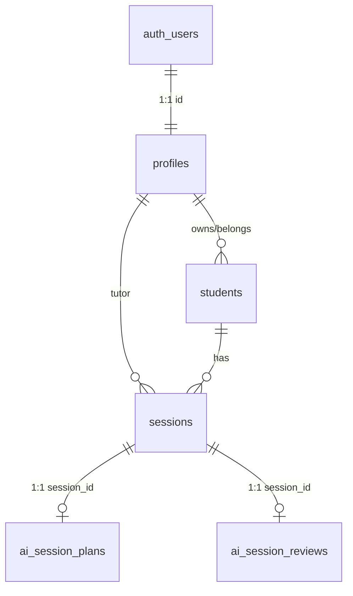

# TutorFlow: A Session Platform for Online Tutors

TutorFlow is a web application designed for online 1-on-1 tutors to manage their students, schedule sessions, take debounced autosaving notes, and leverage Google Gemini AI to prepare personalized lesson plans, summarize completed sessions, assign targeted homework, and generate overall student progress summaries.

---

## Submission Links

- **Live Working URL**: [https://ed-tech-delta.vercel.app](https://ed-tech-delta.vercel.app)
- **GitHub Repository**: [https://github.com/MrNihalT/EdTech](https://github.com/MrNihalT/EdTech)

---

## Test Login Credentials

| Role                | Email                      | Password    |
| :------------------ | :------------------------- | :---------- |
| **Tutor Account**   | `niha.chiyoor@gmial.com`   | `Nihal@123` |
| **Student Account** | `nihaltdevagiri@gmail.com` | `Nihal@123` |

> _Note: New Tutors can also sign up publicly at `/signup`. Student accounts are created directly by Tutors inside the dashboard._

---

## What Works (Features Implemented)

1. **Login with Two Roles (`tutor` & `student`)**:
   - Server-side role enforcement via Next.js Proxy middleware ([proxy.ts](file:///d:/Asus%20Tuf%20F17/projects/next/edtech/proxy.ts)). Tutors access `/tutor/*` and students access `/student/*`. Students cannot access tutor pages or view another student's data.
2. **Student Profiles**:
   - Name, Subject, Current Level (Beginner/Intermediate/Advanced), Learning Goals, and Weak Areas.
3. **Session Scheduling & Double-Booking Prevention**:
   - Tutors pick a student, date/time, and topic. Server-side validation prevents double-booking if the tutor already has a session at that exact timestamp.
4. **Strict Session Lifecycle Enforcement**:
   - State transition: `01 Scheduled` → `02 In progress` → `03 Completed` → `04 AI reviewed`. Invalid jumps are rejected server-side. Once completed, notes become locked and read-only.
5. **Session Notes with ~700ms Debounced Autosave**:
   - While a session is `in_progress`, notes automatically save to Supabase Postgres as the tutor types without requiring a manual save button.
6. **AI Session Plan**:
   - Generates 3 objectives, a 4-point lesson outline, and 3 practice questions personalized using the student's profile and past session history.
7. **AI Session Review**:
   - After marking a session completed, Gemini reads the tutor's notes to return a summary, 2-3 actionable homework tasks, and a next-topic suggestion.
8. **Student Progress View**:
   - Summarizes all past AI session reviews into a single paragraph highlighting improvements, remaining weak areas, and overall progress.
9. **Student Dashboard & Homework Checklist**:
10. **Responsive Mobile Navigation**:
    - Smooth 300ms sliding mobile drawer navigation with backdrop overlay and hamburger menu toggle for seamless use on smartphones and tablets.

---

## Tech Stack & Architecture Choices

- **Framework**: Next.js 16 (App Router, React 19)
- **Language**: TypeScript
- **Styling**: Tailwind CSS (Clean, responsive layout with mobile drawer toggle sidebar)
- **Database & Auth**: Supabase (PostgreSQL + RLS + Supabase SSR Auth)
- **AI Model**: Google Gemini API (`@google/genai` model `gemini-3.6-flash`)

---

## Database Schema & Table Relationships

The database consists of 5 application tables with Row Level Security (RLS) enabled in Supabase:



### Table Structure

1. **`profiles`**:
   - `id` (uuid, PK, references `auth.users(id)` on delete cascade)
   - `full_name` (text, not null)
   - `role` (text, check `role in ('tutor', 'student')`)
   - `created_at` (timestamptz)

2. **`students`**:
   - `id` (uuid, PK, default `gen_random_uuid()`)
   - `user_id` (uuid, FK to `profiles.id`)
   - `tutor_id` (uuid, FK to `profiles.id`)
   - `name` (text, not null)
   - `subject` (text, not null)
   - `current_level` (text, not null)
   - `learning_goals` (text)
   - `weak_areas` (text)
   - `created_at` (timestamptz)

3. **`sessions`**:
   - `id` (uuid, PK, default `gen_random_uuid()`)
   - `tutor_id` (uuid, FK to `profiles.id`)
   - `student_id` (uuid, FK to `students.id`)
   - `scheduled_at` (timestamptz, not null)
   - `topic` (text, not null)
   - `status` (text, default `'scheduled'`, check `status in ('scheduled', 'in_progress', 'completed', 'ai_reviewed')`)
   - `notes` (text)
   - `created_at`, `updated_at` (timestamptz)

4. **`ai_session_plans`**:
   - `id` (uuid, PK)
   - `session_id` (uuid, unique, FK to `sessions.id`)
   - `objectives` (jsonb array)
   - `lesson_outline` (jsonb array)
   - `practice_questions` (jsonb array)
   - `created_at` (timestamptz)

5. **`ai_session_reviews`**:
   - `id` (uuid, PK)
   - `session_id` (uuid, unique, FK to `sessions.id`)
   - `summary` (text, not null)
   - `homework` (jsonb array)
   - `next_topic` (text)
   - `created_at` (timestamptz)

### Supabase Configuration, RLS Policies & Triggers

#### 1. Authentication URL Configuration (Prevent Localhost Redirects)

To ensure email confirmations and magic links redirect to your production app instead of `localhost`:

1. Open your **Supabase Dashboard** -> **Authentication** -> **URL Configuration**.
2. Set **Site URL** to `https://ed-tech-delta.vercel.app`.
3. Add `https://ed-tech-delta.vercel.app/**` to **Redirect URLs**.

#### 2. Instant Student Account Creation (Service Role Key)

When a tutor creates a new student in the portal, the server uses `SUPABASE_SERVICE_ROLE_KEY` to automatically confirm student auth credentials (`email_confirm: true`). This allows newly created students to log in instantly without waiting for or clicking email links.
Ensure `SUPABASE_SERVICE_ROLE_KEY` is added to your `.env.local` and Vercel Environment Variables.

#### 3. Automatic Profile Trigger & RLS Policies (SQL Script)

Run the following SQL in your Supabase SQL Editor:

```sql
-- 1. Automatic Profile Trigger on New User Signup
CREATE OR REPLACE FUNCTION public.handle_new_user()
RETURNS trigger AS $$
BEGIN
  INSERT INTO public.profiles (id, full_name, role)
  VALUES (
    new.id,
    COALESCE(new.raw_user_meta_data->>'full_name', split_part(new.email, '@', 1)),
    COALESCE(new.raw_user_meta_data->>'role', 'student')
  )
  ON CONFLICT (id) DO UPDATE SET
    full_name = EXCLUDED.full_name,
    role = EXCLUDED.role;
  RETURN new;
END;
$$ LANGUAGE plpgsql SECURITY DEFINER;

DROP TRIGGER IF EXISTS on_auth_user_created ON auth.users;
CREATE TRIGGER on_auth_user_created
  AFTER INSERT ON auth.users
  FOR EACH ROW EXECUTE FUNCTION public.handle_new_user();

-- 2. Allow Tutors to Create Student Profiles & Records
CREATE POLICY "Tutors can create student profiles"
ON public.profiles FOR INSERT
WITH CHECK (
  role = 'student' AND EXISTS (
    SELECT 1 FROM public.profiles
    WHERE profiles.id = auth.uid() AND profiles.role = 'tutor'
  )
);

CREATE POLICY "Tutors can insert into students"
ON public.students FOR INSERT
WITH CHECK (
  tutor_id = auth.uid()
);
```

---

## AI Prompts & Rationale

Prompt quality is critical to producing structured, actionable outputs instead of generic filler. Each prompt feeds the student's complete profile and session context to Gemini.

### 1. `SESSION_PLAN_PROMPT`

```text
You are an expert personalized AI tutor assistant for TutorFlow.
Create a structured lesson plan for an upcoming 1-on-1 tutoring session.

STUDENT PROFILE:
- Name: {student.name}
- Subject: {student.subject}
- Current Level: {student.current_level}
- Learning Goals: {student.learning_goals}
- Weak Areas: {student.weak_areas}

PAST SESSIONS HISTORY:
{historyText}

UPCOMING SESSION TOPIC:
{topic}

INSTRUCTIONS:
Return ONLY a valid JSON object matching this schema.
Schema:
{
  "objectives": ["objective 1", "objective 2", "objective 3"],
  "lesson_outline": ["Point 1: Introduction", "Point 2: Core Concept", "Point 3: Guided Practice", "Point 4: Wrap up & Questions"],
  "practice_questions": ["Question 1...", "Question 2...", "Question 3..."]
}
```

**Why it was written this way**: Supplying historical session topics ensures practice questions directly target the student's documented weak areas without repeating previously taught material.

### 2. `SESSION_REVIEW_PROMPT`

```text
You are an expert personalized AI tutor assistant for TutorFlow.
Summarize a completed tutoring session and generate homework based on tutor notes.

STUDENT PROFILE:
- Name: {student.name}
- Subject: {student.subject}
- Current Level: {student.current_level}
- Learning Goals: {student.learning_goals}
- Weak Areas: {student.weak_areas}

SESSION TOPIC:
{topic}

TUTOR NOTES FROM SESSION:
{notes}

INSTRUCTIONS:
Return ONLY a valid JSON object matching this schema.
Schema:
{
  "summary": "Short paragraph summarizing student understanding, progress, and engagement during the session.",
  "homework": ["Task 1", "Task 2", "Task 3"],
  "next_topic": "Suggested topic for the next session"
}
```

**Why it was written this way**: Reading the raw tutor notes allows Gemini to analyze student breakthroughs and difficulties, producing tailored homework tasks for reinforcement.

### 3. `PROGRESS_SUMMARY_PROMPT`

```text
You are an expert personalized AI tutor assistant for TutorFlow.
Generate a comprehensive progress summary for a student based on all past session reviews.

STUDENT PROFILE:
- Name: {student.name}
- Subject: {student.subject}
- Current Level: {student.current_level}
- Learning Goals: {student.learning_goals}
- Weak Areas: {student.weak_areas}

PAST SESSION REVIEWS:
{reviewsText}

INSTRUCTIONS:
Return ONLY a valid JSON object matching this schema.
Schema:
{
  "summary": "One clear, well-written paragraph explaining what the student has improved, remaining weak areas, overall progress, and what should be focused on next."
}
```

**Why it was written this way**: Generates an up-to-date, holistic evaluation of student growth on-demand without storing redundant summary records.

---

## How to Run Locally

1. **Clone the repository**:

   ```bash
   git clone https://github.com/MrNihalT/EdTech.git
   cd EdTech
   ```

2. **Install dependencies**:

   ```bash
   npm install
   ```

3. **Set up Environment Variables** (`.env.local`):

   ```env
   NEXT_PUBLIC_SUPABASE_URL=https://rfxapebbovpyvgdsycem.supabase.co
   NEXT_PUBLIC_SUPABASE_PUBLISHABLE_KEY=your-publishable-key
   SUPABASE_SERVICE_ROLE_KEY=your-service-role-key
   GEMINI_API_KEY=your-gemini-api-key
   ```

4. **Run the development server**:

   ```bash
   npm run dev
   ```

5. Open [http://localhost:3000](http://localhost:3000) in your browser.

---

## What I Would Build Next

If I had another day to expand TutorFlow, I would first integrate email notifications via Resend to automatically send students session reminders and AI-generated homework tasks when a session is scheduled or reviewed. Second, I would add file attachment support so tutors can attach PDF worksheets and students can upload completed homework directly to session records. Third, I would introduce automated recurring session scheduling to allow tutors to set up weekly repeating classes for regular students with a single click.
